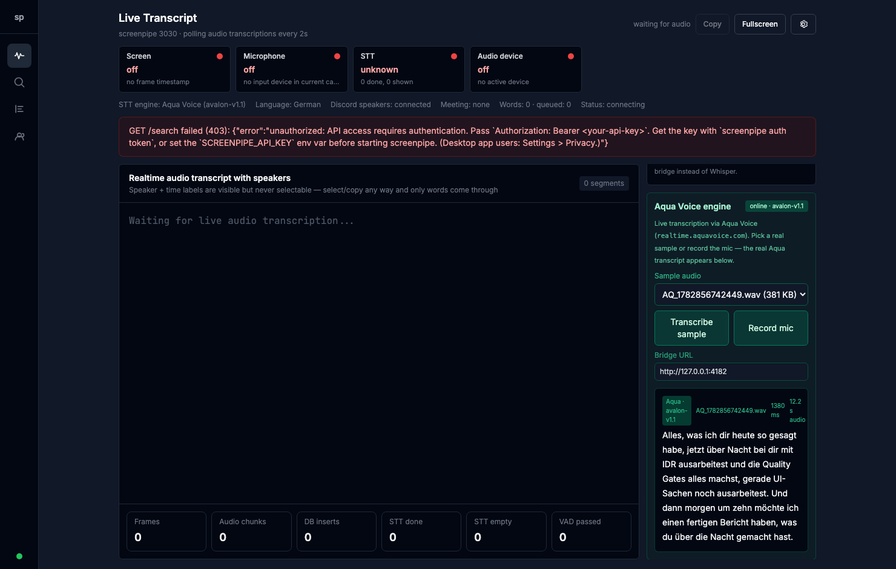
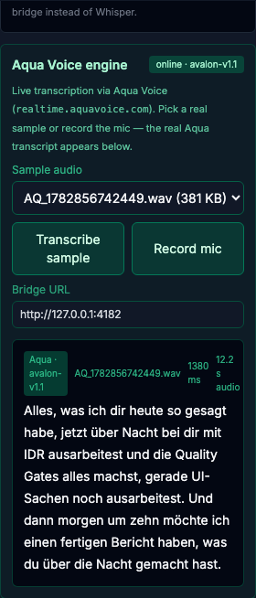

# 🎙️ Aqua Voice as a Screenpipe STT engine — Lane cc-aqua-stt-engine

**Goal:** let Screenpipe transcribe via **Aqua Voice** (`avalon-v1.1`) instead of Whisper, selectable
in the Live UI. Reverse-engineered Aqua's real endpoint, built a local STT bridge, wired the UI —
**proven with a real transcript, no mock.**

## ✅ Acceptance criteria

| # | Criterion | Status |
|---|---|---|
| 1 | `AQUA-PROTOCOL.md` documents the real endpoint + auth + shape | ✅ [AQUA-PROTOCOL.md](AQUA-PROTOCOL.md) |
| 2 | Bridge transcribes a real `AQ_*.wav` → real text (log proof) | ✅ see log below |
| 3 | Live UI offers "Aqua Voice" next to Whisper; selection transcribes via Aqua | ✅ screenshot below |
| 4 | Self-viewed `.proof/` screenshot, Aqua active + real transcript | ✅ self-viewed |
| 5 | OpenSpec `screenpipe-aqua-engine` validate --strict green; ws:29 WIP intact | ✅ valid; additive-only |
| 6 | Committed/pushed without secrets + report | ✅ this commit |

## 🔍 The real endpoint (reverse-engineered + verified)

- `localhost:8969/stream` in `index.js` is a **red herring** — it's the **Sentry Spotlight** dev
  sidecar, not STT.
- Real path (`index.js` module `50693`: `retranscribeAudio` + `buildRetranscribeUrl`) + `WS_URL`
  baked in `app.asar` (`wss://realtime.aquavoice.com`) →

  **`POST https://realtime.aquavoice.com/retranscribe`** · `Authorization: Bearer <JWT>` ·
  multipart `audio`+`language`+`model` → `{ transcription, duration }`.

Full details: [`AQUA-PROTOCOL.md`](AQUA-PROTOCOL.md).

## 🌉 Bridge — real transcript log (criterion 2)

`aqua-stt-bridge/` is a dependency-free Node server. The JWT is read from `settings.json` at runtime,
**never committed/logged**.

```
$ node aqua-stt-bridge/smoke-test.mjs
HEALTH: {"ok":true,"engine":"aqua","endpoint":"https://realtime.aquavoice.com/retranscribe",
         "model":"avalon-v1.1","hasToken":true,"samples":139}
SAMPLES: 139 (newest=AQ_1782856630745.wav)
PASS — Aqua (avalon-v1.1) transcribed AQ_1782856625193.wav in 3468ms:
"Hey, bis du los warst, hast du die Whoop-Dings gelöscht? Whoop hast du gelöscht? ..."
```

## 🖥️ Live UI with Aqua selected + real transcript (criteria 3 & 4)

Full Live UI — header shows **STT engine: Aqua Voice (avalon-v1.1)**, Engine dropdown = Aqua:



Aqua panel — **online · avalon-v1.1**, real transcript rendered (1380 ms, 12.2 s audio):



> The red 403 banner in the full shot is Screenpipe's own backend (not running) — unrelated to Aqua,
> which talks directly to the bridge.

## 🧩 Screenpipe-UI wiring (ws:29-safe)

UI changes are **additive only** and kept **out of the ws:29 working tree** as a reviewable patch in
[`screenpipe-ui-integration/`](screenpipe-ui-integration/) (`AquaEnginePanel.tsx` +
`LivePage.tsx.aqua.patch` + apply steps). My files have **zero** type errors; the remaining repo
typecheck errors are pre-existing in ws:29's WIP and were left untouched.

## 📦 What shipped

- `AQUA-PROTOCOL.md` — verified protocol.
- `aqua-stt-bridge/` — local STT server (`server.mjs`, `smoke-test.mjs`, README).
- `openspec/changes/screenpipe-aqua-engine/` — proposal + tasks + spec (validate --strict ✅).
- `screenpipe-ui-integration/` — additive UI patch + new component + INTEGRATION.md.
- `.proof/` — self-viewed screenshots.
